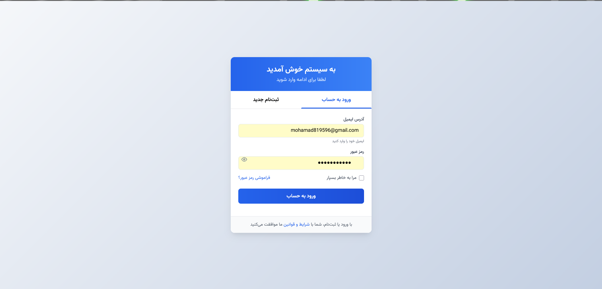

 سیستم وبلاگ آموزشی تکنولوژی , فناوری

یک پلتفرم وبلاگ‌نویسی مدرن و امن برای انتشار مقالات و آموزش‌های فناوری، علوم کامپیوتر و مفاهیم روز دنیای دیجیتال.

---

## ✨ معرفی پروژه

 یک وب‌سایت آموزشی مبتنی بر فریمورک قدرتمند Laravel است که به ادمین‌ها اجازه می‌دهد مقالات و مطالب تخصصی حوزه فناوری را منتشر کنند. کاربران می‌توانند مقالات را مطالعه کنند، نظرات خود را درج کنند، و در مباحث شرکت داشته باشند.

> برای مشاهده کامل محتوا، کاربران نیاز به ورود به حساب کاربری دارند. در صورت عدم ورود، به صفحه ثبت‌نام یا ورود هدایت خواهند شد.

---

## 🎯 ویژگی‌های کلیدی

- مدیریت کاربران با **Sanctum Auth**
- سیستم احراز هویت با ایمیل و بازیابی رمز عبور (Forget Password)
- پنل ادمین قدرتمند برای:
  - ایجاد، ویرایش و حذف پست‌ها
  - جستجوی پست‌ها
  - افزودن ادمین‌های جدید
  - بروزرسانی اطلاعات حساب
- کامنت‌گذاری زیر مقالات برای کاربران
- قابلیت پاسخ به کامنت‌ها (ریپلای)
- ارسال **نوتیفیکیشن ایمیلی** به صاحب کامنت هنگام پاسخ
- **مستندسازی Swagger** برای تمام APIها
- ارتباط Front و Backend از طریق RESTful API
- طراحی مدرن و سبک با HTML، CSS و JavaScript

---

## 🛠️ تکنولوژی‌ها و ابزارهای استفاده‌شده

| بخش | ابزارها |
|-----|---------|
| زبان برنامه‌نویسی | PHP (Laravel) |
| طراحی رابط | HTML / CSS / JavaScript |
| احراز هویت | Laravel Sanctum |
| مستندسازی API | Swagger (OpenAPI 3.0) |
| پایگاه‌داده | MySQL (قابل تغییر به PostgreSQL یا SQLite) |
| ارسال ایمیل | Laravel Notification System |
| معماری API | RESTful API |

---

## 📸 اسکرین‌شات‌ها

| صفحه | تصویر |
|------|--------|
| صفحه اصلی |  |
| نمایش پست |  |
| پنل مدیریت |  |
| فرم ورود |  |

---

## 👨‍💻 توسعه‌دهنده

**محمدرضا میرشفیعی**  
Laravel Developer & Backend Engineer  
[GitHub Profile](https://github.com/mobin-em)

---

